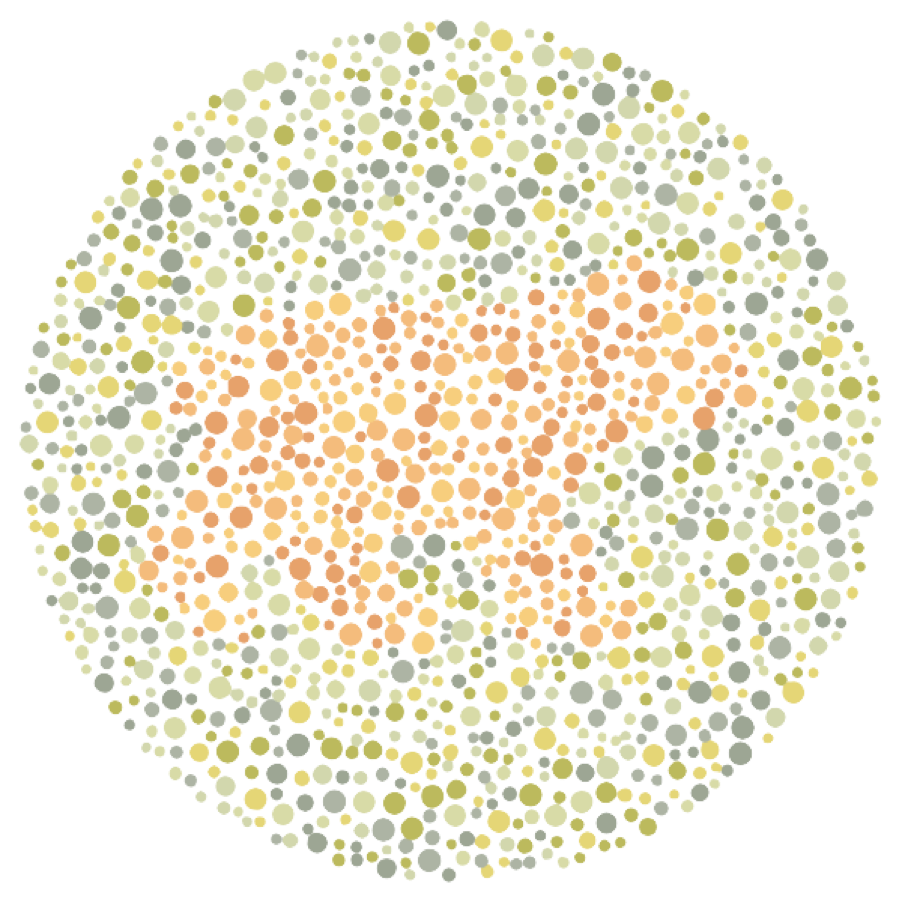

# VisualHelper

---

**: Web transformer designed for visually impaired people** 

> By [Myungbin Son](https://pinkishincoloragain.me/)
> 

The **goal** of this **VisualHelper** is to design and develop a **system and a chrome extension** to help visually impaired people **efficiently read the web page**. Another aspect of the project is to **change the layout of the web page** to a visually organised format and **enhance the user experience.**

- [**Testing website](https://visualhelper.netlify.app/) (Under construction)**
- [**Presentation**](https://drive.google.com/file/d/1m1nmDARVZ4xaEC7pRl-fP630u1ixQWDx/view?usp=sharing)
- [**Business plan**](https://drive.google.com/file/d/1BOTxN-Kt5V2hqBNq_DvV5Cv9hI1G_jUj/view?usp=sharing)
- [**Design files**](https://www.figma.com/file/kYzncGAImxsKOspxJHnWDX/Individual-project?node-id=0%3A1)

## Table of contents

---

- [Logo](https://www.notion.so/VisualHelper-faacd65a35704e09b34e55d861ea4d1b)
- [Backgrounds](https://www.notion.so/VisualHelper-faacd65a35704e09b34e55d861ea4d1b)
- [System architecture](https://www.notion.so/VisualHelper-faacd65a35704e09b34e55d861ea4d1b)
- [Implementation](https://www.notion.so/VisualHelper-faacd65a35704e09b34e55d861ea4d1b)
- [Technologies](https://www.notion.so/VisualHelper-faacd65a35704e09b34e55d861ea4d1b)
- [Roadmap](https://www.notion.so/VisualHelper-faacd65a35704e09b34e55d861ea4d1b)
- [Appendix](https://www.notion.so/VisualHelper-faacd65a35704e09b34e55d861ea4d1b)

## Logo

---

VisualHelper

## 

## Backgrounds

---

**WebAIM** conducted a study in 2020 (Screen Reader User Survey #8 Results, 2020) that only 2% of the websites meet the requirements of the visual assistants which is essential for visually disabled people to properly read the website. According to the survey, visually impaired users have difficulty reading 98% of websites without the use of an external screenreader.

## System Architecture

---

This is the system architecture of the entire system. The system’s three main components are Cloud service, Client, and web application. Three main components interact with each other using either JSON or message passing. All communication protocols are based on the Internet connection.

**Cloud service** consists of a management system and Firebase Firestore. Cloud service stores the data of the user and supports the synchronisation of data. User data includes user identification information and filter information.

**Web application** tests users with visual impairment tests. Web application analyses the result and configures filter with a complex algorithm.

**The** **Client-side of the system** operates on the top of google chrome. Chrome extension receives user data from the cloud service and configures the desired filter.  Chrome extension also manages the transformation of the client web page.

### Use Cases

### Client

Figure 3.3.3 shows the system architecture of the web application. The web application lets users take 3 types of tests to configure the appropriate filter for the user. 3 types of tests are colour test, reading test, and web proficiency test. Also, the testing page collects the elapsed time the user took to answer each question.

The testing and analysing process of the application consists of 3 steps.

1. The user takes three types of tests with time limits. The application collects the elapsed time and the submitted answer every time the user submits the answer for the question.
2. The application analyses the result of the test and configures the filter according to the algorithm. The filter configuration algorithm is explained in Figure 3.4.1.
3. The application sends the configured filter to the cloud service.

### Algorithm

Figure 3.4.1 shows the algorithm of how the web application evaluates the test result and configures the web transforming filter for the user. The process of configuring the filter consists of three parts: test page, test result analysis and the filter.

The test page consists of three tests. Each test consists of 3 or 4 questions and the total number of questions is 10. The web application measures the elapsed time from the start of each question to the moment that the user submits his answer. If the user does not submit the answer to the question until the time limit, the system automatically moves the user to the next question and regards that the user got the wrong answer.

When the user finishes 10 questions, each test result goes through its evaluation and analysis algorithm. Each analysis configures unique attributes which affect the final result of the filter. The elapsed time information is analysed to evaluate the confidence of the answer. If the user has taken more time, the confidence in the question decreases which leads the user to get lower points on the test.

Each test has different types of questions and utilises a different technique to analyse the result.

The Colour test consists of 3 single choice questions. The user is expected to figure out the number of the photo. Each of the 3 questions is designed to detect the visual impairment of red, green and blue-yellow colours. The colour analysis configures greyscale, contrast and saturation, and the theme colour of the filter.  Modifying these attributes helps the visually impaired users avoid the weak colours and helps define the boundaries of each element of the web page. Also, the web page can change the theme colour if the user is expected to be weak to the colour.

The reading test consists of 3 reading questions. The user is expected to read the sample paragraph of text and press the button as soon as finishing reading the paragraph. 3 questions are designed to find the user’s preference of paragraph style. The elapsed time of each question indicates the user’s preference for the style.

The reading test analysis configures font size, letter spacing, margin and padding of the filter, and other text decoration attributes. Modifying these attributes helps visually impaired users understand the content at a similar speed to a standard user.

The web proficiency test consists of 4 complex questions. The user is expected to find out information from the web page or interact with the specific element of the web page. These questions are designed to analyse how much the user can understand the content and make use of the web page. Web proficiency analysis configures layout transformation attributes, alternative texts of the images, HTML tags for the screen reader, and errors of the web page. Modifying layout and element attributes are expected to enhance the overall user experience by fitting the content in a familiar layout to the user.

When the test results analysis finishes, the configured attributes are converted to the corresponding algorithm. The filter consists of three colour modification, text transformation, and layout transformation algorithms. Three algorithms compose one filter after the integration and optimisation of the algorithm.

Figure 3.4.2 shows the classification algorithm for 3 types of colour-blindness. This algorithm considers both time and the answer to check if the user has a visual impairment or not. The severity of the visual impairment is also classified into 3 levels which are slight visual impairment, severe impairment and blindness.

Also, taking more than standard time to figure out the answer will be considered a failure to get the correct answer.

### Cloud service

Figure 3.3.4 shows the system architecture of the cloud service. The cloud service consists of 2 parts: a Firebase Firestore and a management system.
The management system handles the incoming CRUD request from the web application and chrome extension.

Firebase Firestore is a NoSQL database that stores the data of the users, filters and test results.

Figure 3.3.5 shows the data model of the database. There are three collections in the database: User, Filter and Test. The data of these collections are converted to a JSON format and delivered to the extension and web page when the request arrives at the management system.

Filter collection contains a filter ID, filter configuration and a filter object. Filter Object is the webpage transforming algorithm itself which is configured by the testing webpage. Filter configuration defines the specific attributes of the filter which are generated in the web application.

User collection contains a session ID, cookie, and filter ID. Session ID and the cookie are used to define the user without any authentication or login. Filter ID is used as a key of the configured filter of the user.

Test collection contains test ID, session ID, user answer and the test result. Test collection stores the test result with the elapsed time of each question. The data from the test collection can be used for further analysis for the development of the system.

## Implementation

---

### Chrome extension

Chrome extension receives data from the cloud database and configures the appropriate filter for the user. This process consists of three steps which are receiving and synchronising, calculating the filter and changing the webpage. This event is triggered by clicking the chrome extension button.

**Receiving and synchronising**

Chrome extension receives and synchronises the data when activated. This process is supported by Firebase database configuration,

**Calculating filter**

When the chrome extension receives the data from the database, it will read the filter data and configure the filter. This process modifies various tags including div, p, a, and span and changes the website to be easily readable to the target user. Additionally, the chrome extension filter algorithm checks the adjacent nodes to check if the contrast is low or not.

**Changing the web page**

Chrome extension changes the web page document after the document is fully loaded to the page. The user will trigger it by selecting the button in the chrome extension.

The reason for changing the web page after the document is fully loaded is that many websites have the form of a SPA application which dynamically loads the main elements with Javascript at runtime. Modifying the webpage in the middle of the runtime can cause a crash and can cause the browser to fail to perfo

### Testing Web app

## Used technologies

---

- **React.js: 17.0.2**
- **React-redux: 7.2.6**
- **Mui: 5.4.3**
- **Sass: 7.0.1**

## Roadmap

---

## Appendix

---

